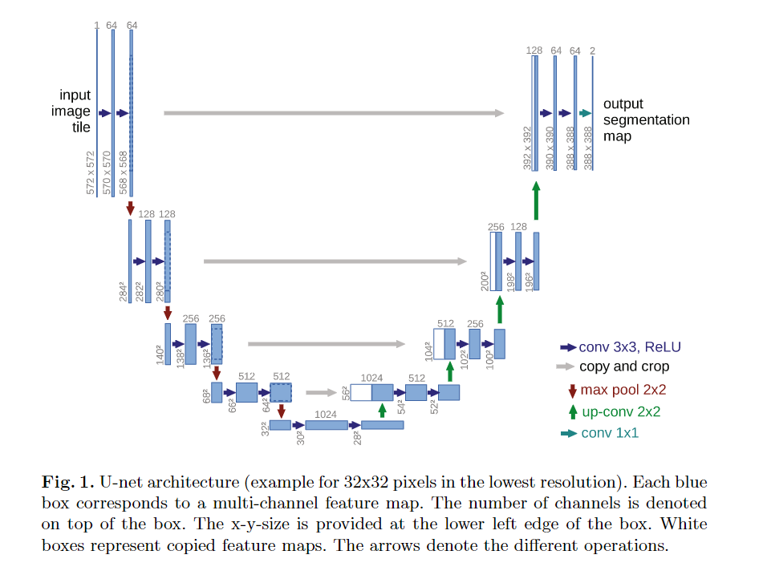

# Deep learning-based classification of mesothelioma improves prediction of patient outcome

## abstract

Malignant mesothelioma（恶性间皮瘤）简称MM，是一种主要根据组织学标准诊断的侵袭性癌症。

根据世卫组织WHO的分类，MM分成三种：

- epithelioid（上皮状） MM
- biphasic（双相） MM
- sarcomatoid（肉瘤样） MM

MM是一种高度复杂且异质性的疾病，使其诊断和分型非常困难，导致不理想的患者护理和治疗方案的决定

于是本文提出了基于深度卷积神经网络的方法，称之为MesoNet，可以从全载玻片数字化图像中准确预测MM患者的总生存率，而且没有任何病理医生提供的局部注释区域

**验证MesoNet:**

-  internal validation cohort  ->   French MESOBANK   
-  independent cohort             ->   TCGA(The Cancer Genome Atlas)  

还在证明该模型预测患者生存率方面比当前的病理学实践更准确

此外，与经典的黑盒深度学习不同，MesoNet识别的区域有助于患者的预后的预测。

并且这些区域主要位于间质中，是与炎症、细胞多样性和空泡化相关的组织学特征。这些发现表明，深度学习模型可以识别预测患者生存的新特征，并有可能导致新的生物标志物的发现(biomarker)

## Result Analysis

**病理基本性质**

| type |   prognosis    | median overall survival（OS）/ months |
| ---- | :------------: | :-----------------------------------: |
| EMM  | most favorable |                  16                   |
| SMM  |     worst      |                   5                   |
| BMM  |  intermediate  |                                       |

传统组织学分类具有预后和治疗价值，但是不足以涵盖MM患者所有的临床特征和预后的极端变异性，所以需要一种新的方法来寻找预测标志物并且该标志物和生存率存在一致性相关。

传统的深度学习方法能识别组织切片，但是这种方法常常被视为黑盒模型，提取的图像特征难以理解（解释性不强）。

MesoNet通过针对此类场景来改进算法。仅使用全局标签来训练预测模型。

**模型整体流程：**

- 对MM患者的WSI进行预处理，分成112$\times$112$\mu m$的方块，称为$tiles$。
- $tiles$投喂到网络架构中，为每个$tiles$打上一个survival score
- 网络选择每个WSI中与预测最相关的$tiles$，使用有限数量的$tiles$预测患者的OS

**数据集：**

- 使用来自2981名 pleural mesothelioma 患者共2981张slides（MESOPATH/MESOBANK)
- 随机不放回抽样一个Train set (2300 slides) 和 完全独立的 Test set（681 slides)
- 在Train set中，使用 fivefold cross-validation的训练策略，并使用Test set进行评估
- 并使用额外56名MM患者 共 56张WSI作为validation set（来自 TCGA），检测模型的鲁棒性

**同方向性能比较：**

将MesoNet与病理学提供的组织学类型进行比较，使用$c-index$作为评估标准。

在训练集上，MesoNet使用交叉验证的方法显著优于baseline model，证明该方法的有效性。

|  Model  | compared | score1 | score2 |      P(t-test)       | dataset |
| :-----: | :------: | :----: | :----: | :------------------: | :-----: |
| MesoNet |  Histo   | 0.642  | 0.596  | $< 1\times 10^{-30}$ |  Train  |
| MesoNet |  Histo   | 0.643  | 0.598  | $< 1\times 10^{-30}$ |  Test   |
| MesoNet |  Histo   | 0.656  | 0.590  | $< 1\times 10^{-30}$ |  TCGA   |

MesoNet在MESOBANK的Train set和Test set上表现就不如MeanPool，但是在TCGA上表现明显优于MeanPool，表明MesoNet在独立数据集上的鲁棒性（和MeanPool等聚合方法比较）

|  Model  | compared | score1 | score2 |       P(t-test)       | dataset |
| :-----: | :------: | :----: | :----: | :-------------------: | :-----: |
| MesoNet | MeanPool | 0.642  | 0.657  | $< 1\times 10^{-30}$  |  Train  |
| MesoNet | MeanPool | 0.643  | 0.649  | $5.78\times 10^{-18}$ |  Test   |
| MesoNet | MeanPool | 0.656  | 0.581  | $2.66\times 10^{-20}$ |  TCGA   |

此外，MesoNet仍然优于年龄和性别组合的经典模型。

被诊断为SMM的患者与糟糕的预后相关。在Test中，60个患者的子集有7.2个月的中位生存期。

相比之下，MesoNet预测最差的预后的60个患者的集合，是三种类型的混合（34%SMM，40%EMM）

这两个子集具有可比性（P=0.53，log-rank），表现出MesoNet可以提取未知的预测特征，并且可以识别出预后非常差的EMM患者。

Grade 1 EMM 患者被认为是预后最好的。Test中80名患者的中位生存期为28.1个月。

MesoNet预测生存期最高的80例患者均为EMM，具有类似预后，但是分级不同，表明MesoNet也能提取肿瘤分级正交的预测特征。（P=0.3， log-rank）

与组织病理学分类对比，MesoNet的主要优点在能够输出连续的风险评分，而不是离散的患者分类。将测试集分为低中高风险组，提供公平的比较。分的三个风险组在整个数据集中都有显著不同的结果（P=$2.86\times 10^{-18}$，log-rank ）。而且能在EMM患者组和每一级的组中识别出显著的不同。

|      |         EMM          | Grade 1 | Grade 2 | Grade 3 |
| :--: | :------------------: | :-----: | :-----: | :-----: |
|  P   | $3.03\times 10^{-8}$ | $0.016$ | $0.005$ | $0.022$ |

表明MesoNet可以提供独立于组织学类型和分级的风险评分。

同时tile 评分系统允许为每个tile进行评分，对于预后良好的患者，其结果分布向负值移动；反之，预后较差的患者，其结果向正值移动。该评分系统会为病理学家提供配套工具，帮助识别已知或者新的有关每一个病人生存的区域。

通过比较同一患者的多次活检获得预测评分与其他患者活检的预测评分的相似性，来评价组织取样的稳健性。得到个体内变异显著低于个体间变异（P=$9.66\times 10^{-20}$，表明MesoNet对组织取样具有鲁棒性。

然后通过毒地切片中所有tile评分汇总到一个单一分布中，提取与患者生存率相关的tile评分，获得组织学预测特征的全面理解。

两个专家手动独立

大多数低生存相关的tile位于基质区域，而不是肿瘤内。

（后面就是对于相关性的分析）

## Detailed Model Structure

### Matter extraction

首先检测图像中包含物质的部分。分割使用**U-Net神经网络方法**，所有像素分为两类：pixel of the foreground（前景像素，包含内容）和 pixel of the background（后景像素）

### Tiling

将检测到物质部分的slides分割为更小的图像，称为tiles，图像大小为$224\times 224$ pixels。至少有20%的tile必须被U-Net模型检测为前景，才能被当成一个包含物质的tile。tile的数量取决于探测到的物质大小，从几百到几万块不等。考虑计算和内存，将其限制在10000块内。

### Feature extraction

使用ResNet-50 来进行，该模型已经使用识别任务进行预训练，允许从每个tile中获得2048个相关特征。因此每个slide获得一个$10000 \times 2048$的矩阵。如果没有足够的物质来提取足够的tile，使用0来fill矩阵。最后得到一个张量：$\text{玻片数}\times 10000 \times 2048$

### Top and negative instances

使用一个一维的卷积层来为每个tile创建一个分数。卷积层在tile所有的2048个特征之间执行加权和以获得这个分数。（权重由模型进行学习）。而且一维卷积层是无偏的，保证所有零填充的tile都有0分，因此是完全无信息的tile。然后选择10个最高和10个最低的分数，并将其作为最后一步的输入。这样的架构确保了使用哪些tile进行预测，也确保了算法如何预测结果。

### Multi-layer perception（MLP）

最后一步是设置一个MLP，两个全连接层（200和100个神经元，带有sigmoid神经元）。他是预测算法的核心，将分数从tile转换为预测。

## Model improvements

### U-Net segmentation

原生的MesoNet pipline 演示中，分割使用Otsu算法进行，是一种常用的不需要训练的分割方法。然后这种分割方法不够健壮，在包含伪影的幻灯片上失败，如 ink marks（返回一个空的mast，数据未显示）。因此使用U-Net方法，在几百张组织学图像的缩略图上进行训练，其中的matter是手动选择的，每个缩略图都是一个$256 \times 256$像素的图像。 

### Survival loss

MesoNet先前被用于分类问题，因此该架构的最后一层从sofmax转换成线性激活，从而更好地预测生存，类似于回归问题。此外，这个问题不同于回归（因为 censored data），并且需要一个特定的损失函数（如Cox loss函数，允许使用来自 censored data的信息）。

### Auto-encoding

MesoNet像许多模型一样可能会出现过拟合的情况。将网络预测的部分输入维数减少到512个特征而不是2048个特征来解决机器学习中的循环问题。使用了一个自动编码器，由一个单一的隐藏层（512个神经元）组成。通过在训练数据集中识别几个奇异特征来防止我们模型过拟合，同时也减少计算时间和所需内存。从每张slide中随机选择200个tile，在三个epoch中收敛到0.00235（mse）

## Assessment of performance

使用C-index 量化一组患者的预测生存时间和真实生存时间之间的一致性。这个度量标准通常用于评估和比较预测模型与censored data之间的一致性。C-index评估预测的生存时间是否与真实生存时间的排序顺序相同。由于censored data，患者生存时间的实际顺序并不总是可用的。

例如，如果一个病人$i$在$t_i$时去世，而病人$j$在$t_j$时仍然存活而且$t_i>t_j$，这对患者的实际生存顺序是不可用的，因为患者$j$可能在$t_i$之间去世或者没有。这对患者就会被定义为 non-admissible pair，与admissiable pair相反即患者的生存顺序是可用的。

C-index：
$$
c-index = \frac{\text{number of concordant pairs}}{\text{number of admissible pairs}}
$$
其中，一致性对（concordant pair）是被正确分了的患者对，可接受对（admissible pair）是可用排序的患者对。例如，病人$i$和$j$没有截止，或者病人$i$在$t=k$死亡，病人$j$在$t>k$时截止，那么$(i,j)$就是可以接受的。反之，则不可接受。

*那么理解成预测组和真实组，即预测和真实的分类相同，那么预测成功。 而截止是说明两者*

C指数即一致性指数（concordance
index），用来评价模型的预测能力。

c指数的计算方法是：把所研究的资料中的所有研究对象随机地两两组成对子。以生存分析为例，对于一个病人，如果生存时间较长的一位的预测生存时间也长于另一位的预测生存时间，或预测的生存概率高的一位的生存时间长于生存概率低的另一位，则称之为预测结果与实际结果一致。

## 模型结构

Matter extraction: U-Net neural-network

将所有像素分为两类

  

https://blog.csdn.net/m0_38088084/article/details/107463973

